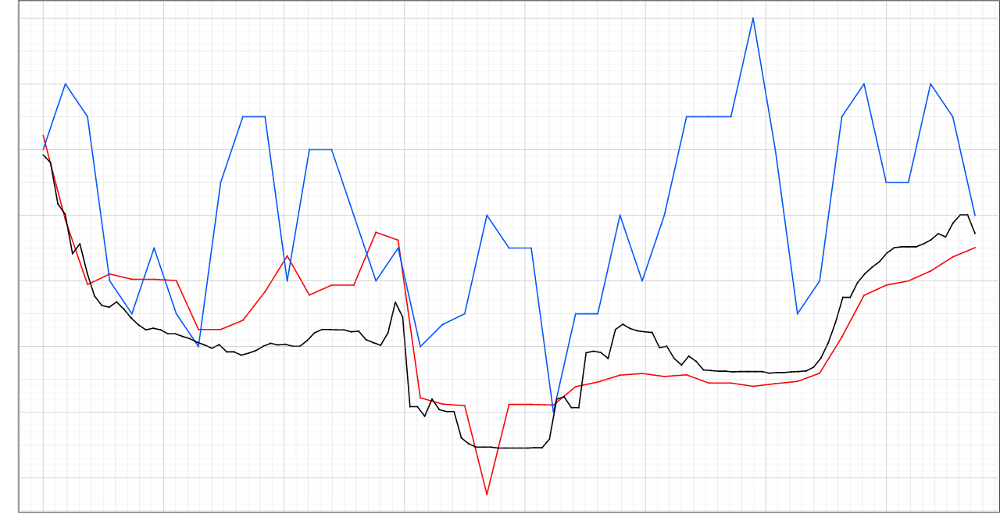
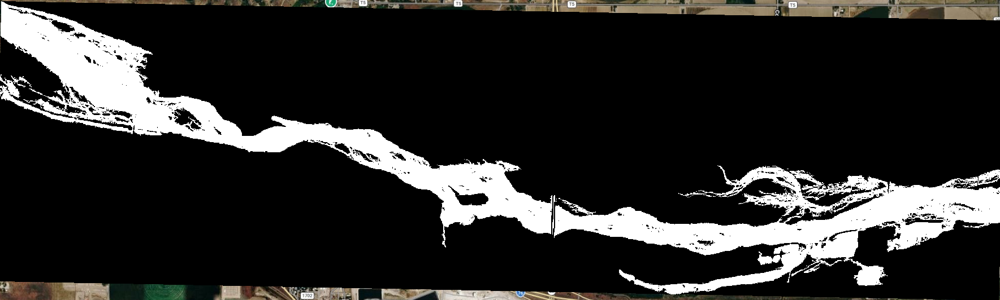
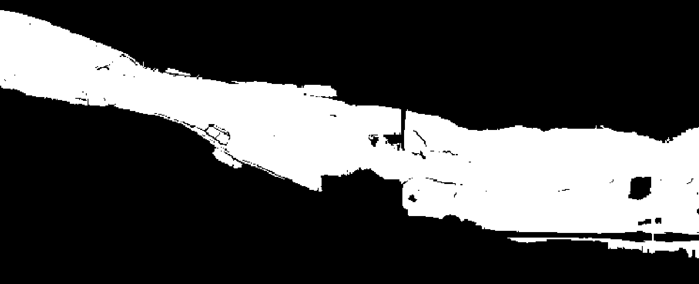
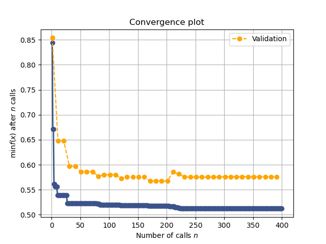

# Introduction
The BYU Hydroinformatics lab has developed a global hydrologic model, dubbed the Group on Earth Observations GEO Global Water Sustainability (GEOGLOWS) River Forecast System (RFS), which simulates river flow conditions across millions of river reaches globally. The lab is interested in developing flood inundation mapping capabilities, which involves generating flood inundation maps based on the simulated river flow conditions. There are two key factors that can influence the accuracy of flood inundation maps: the choice of Digital Elevation Model (DEM) and the value of Manning's *n*. Manning's *n* is a coefficient used in hydraulic models to represent the roughness of a channel or surface. Different Digital Elevation Models (DEMs) might require different values of Manning's *n* to generate the same flood extents. Additionally, DEMs themselves may have varying levels of accuracy and resolution. In this analysis, we will investigate how Manning's *n* values applied to different DEMs affect the Critical Success Index (CSI) when comparing generated flood inundation maps to reference maps, and investigate if there is a way of combining the flood inundation maps generated from different DEMs to improve the overall performance of the flood inundation mapping.

# Data and Methods
The primary datasets we need are the DEMs, the Manning's *n* classification coverage, and the reference or "ground truth" flood inundation maps. Other datasets required for running the hydraulic model are held constant and will not be considered further (they have been tested in previous analyses). A summary of the datasets used can be found in @tbl-datasets.

| Dataset | Description | Reference |
|---------|-------------|-----------|
| ASTER | Advanced Spaceborne Thermal Emission and Reflection Radiometer (ASTER) Global Digital Elevation Model Version 3 (GDEM 003) | [@nasametiaistjapan_spacesystems_and_usjapan_aster_science_team_aster_2019]  |
| AW3D30 | JAXA ALOS World 3D - 30m (AW3D30) Global Digital Surface Model | [@xu_importance_2021] |
| COPDEM | Copernicus Digital Elevation Model (COPDEM) Global 30m | [@nandam_framework_2024] |
| FABDEM | Forest and Buildings Removed Digital Elevation Model (FABDEM) Global 30m | [@nandam_framework_2024] |
| GEDTM | Global Ensemble Digital Terrain (GEDTM) Global 30m | [@ho_global_2025] |
| NASADEM | NASA Digital Elevation Model (NASADEM) Global 30m | [@opentopography_nasadem_2021] |
| SRTM | Shuttle Radar Topography Mission (SRTM) Global 30m | [@ferreira_vertical_2021] |
| USGS | USGS 3D Elevation Program (3DEP) 10m, US only | [@noauthor_13rd_2025] |
| ESA WorldCover 2021 | Land cover from ESA WorldCover 2021 categorized into Tree Cover, Grassland, Cropland, Built-up, Barren, and Water, among others | [@zanaga_esa_2022] |
| USGS FIM  | Flood inundation maps from USGS Flood Inundation Mapping program for 30 sites across the US with multiple flood stages | [@noauthor_web_nodate] |

: Summary of datasets used in the analysis. {#tbl-datasets}

## DEMs
We use the following DEMs in our analysis: ASTER, AW3D30, COPDEM, FABDEM, GEDTM, NASADEM, SRTM, and USGS. Each DEM has different spatial resolutions and accuracies, which can affect the derived Manning's *n* values and the flood extents. The USGS DEM, from the USGS 3DEP program, is considered the most accurate and serves as our reference DEM. 

## Manning's *n* Classification
Manning's *n* values are assigned based on land cover classifications. We use land cover from ESA WorldCover 2021, which has a spatial resolution of 10 meters. The land cover classes are categorized into six types: Tree Cover, Grassland, Cropland, Built-up, Barren, and Water. There are additional land cover classes in the dataset, but they are occur infrequently in the typical flood plain and are not included in this analysis. 

## Reference Flood Inundation Maps
We use reference flood inundation maps generated from the USGS Flood Inundation Mapping program. These maps are created using advanced hydraulic models, calibrated on observed flood events, and are considered the "ground truth" for our analysis. We have data for 30 sites across the US, with multiple flood stages per site, and for each stage we have a reference flood inundation map.

@fig-dems shows a visualization of different DEMs for a sample site, illustrating the differences in elevation data that can lead to different Manning's *n* values and flood extents.

::: {#fig-dems layout-ncol=2}


(a) ASTER DEM


(b) FABDEM


(c) USGS DEM


(d) Elevation comparison

Visualization of different DEMs for a sample site.

:::

## Data Analysis Methods
There are two main components to our analysis: 1) calibrating Manning's *n* values for each DEM, and 2) investigating if there is a way of combining the flood inundation maps generated from different DEMs to improve the overall performance of the flood inundation mapping. We first calibrate Manning's *n* values for each DEM, and then use the optimal Manning's *n* values to generate flood inundation maps for each DEM, which we then attempt to combine in different ways. The approach we use is as follows:

1. Define a range of allowable Manning's *n* values for each land cover type. We chose a range of 0.0001 to 10, which gives us a wide range of values to test. Typical values for Manning's *n* tend to vary between 0.01 and 0.5, but we want to allow for a wider range to ensure we are not missing any potential optimal values.
2. Using Bayesian minimization, we begin with an initial guess of Manning's *n* values for each land cover type and iteratively adjust these values to maximize the CSI. The objective function will run the hydraulic model using the Manning's *n* provided. We train on 70% of the sites, leaving the remaining 30% to be used as validation, to check for over-fitting. The validation sites are evaluated every 10 iterations, with the total number of iterations for training being 400. We invert the CSI to minimize it instead of maximizing it (CSI ranges from 0-1, 1 being a perfect match). This process is repeated for each DEM, resulting in an optimal set of Manning's *n* values for each.
3. Using the optimal Manning's *n* values for each DEM, we generate flood inundation maps for each DEM and compare them to the reference maps using the CSI. We then investigate several methods of combining the flood inundation maps, including:
    i) K-of-n voting: A pixel is classified as flooded if at least K out of N DEM-derived flood maps classify it as flooded. We test the whole range of K values from 1 to N (where N is 7, the number of DEMs tested).
    ii) Logistic regression: For each site, we train a logistic regression model using the DEM-derived flood maps as features and the reference flood map as the target. The logistic regression model learns the optimal weights for each DEM-derived flood map to maximize the CSI. We chose to group by site due to memory concerns with training a single model across all sites, but this is something that could be explored in future work. For each site-trained model, we evaluate on all sites and stages.

# Results

::: {#fig-floods layout-ncol=2}


(a) Reference flood inundation map


(b) FABDEM flood inundation map


(c) USGS DEM flood inundation map


(d) ASTER DEM flood inundation map

Visualization of flood inundation maps for Fort Morgan, Colorado, at a stage of 18 feet.

:::

Optimal Manning's *n* values were discovered for each DEM using Bayesian minimization. Examples of flood maps for the same sample site and stage for four DEMs are shown in @fig-floods. An example of the convergence and validation process for FABDEM is shown in @fig-convergence. From the figure, we can see that the optimizer converges after about 250 iterations, and that the validation score closely follows the training score, indicating that the optimizer is not over-fitting. This trend is similar across all DEMs, with convergence occurring between 200-300 iterations and no evidence of over-fitting.

{#fig-convergence}

@fig-n-vs-fstat shows the converged-upon Manning's *n* values for each land cover type and DEM, along with the corresponding CSI scores. The vertical red dotted lines indicate the range of typical Manning's *n* values for each land cover type, based on literature values.

```{r}
library(tidyverse)
library(dplyr)
library(ggplot2)
library(scales)
names <- c("aster", "aw3d30", "copdem", "fabdem", "gedtm", "nasadem", "srtm", "usgs")
df <- data.frame()

for (name in names) {
    temp_df <- read.csv(paste0("data_files/official_mannings_n_", name, ".csv"))
    temp_df$DEM <- name
    df <- rbind(df, temp_df)
}

df <- df |>
  mutate(Parameter = case_when(
    Parameter == "Manning_n_10" ~ "Tree Cover",
    Parameter == "Manning_n_30" ~ "Grassland",
    Parameter == "Manning_n_40" ~ "Cropland",
    Parameter == "Manning_n_50" ~ "Built-up",
    Parameter == "Manning_n_60" ~ "Barren",
    Parameter == "Manning_n_80" ~ "Water",
    TRUE ~ Parameter
  ))
```
```{r}
#| fig-width: 7.5
#| fig-height: 6
#| fig-cap: "Manning's *n* vs Average F−Statistic Score for Different DEMs"
#| label: fig-n-vs-fstat
ggplot(df, aes(x = Value, y = Score, color = DEM)) +
  geom_point(size = 4) +
  geom_vline(
    xintercept = c(0.01, 0.5),
    color = "red",
    linetype = "dotted",
    alpha = 0.7
  ) +
  scale_x_log10(labels=label_number(),
    breaks = c(0.0001, 0.001, 0.01, 0.1, 1, 10)) +
  facet_wrap(~Parameter) +
  labs(
    title = expression("Manning's " * italic(n) * " vs Average CSI Score for Different DEMs"),
    x = expression("Manning's " * italic(n)),
    y = "CSI Score"
  ) + theme_bw() +
  theme(axis.text.x = element_text(angle = 45, hjust = 1),)
```

Looking at this figure, we see some interesting trends. For tree cover, grassland, and water land cover classes, the optimal Manning's *n* values fall within the typical range of values found in literature. They also are quite consistent across the majority of DEMs. This suggests that for these land cover types, the choice of DEM may not have a large influence on the optimal Manning's *n* values. For cropland, built-up, and barren land cover classes, there is much more variability in the optimal Manning's *n* values across DEMs, and many of the optimal values fall outside the typical range found in literature. This suggests that for these land cover types, the choice of DEM can have a significant influence. We must note that grassland, tree cover, and water are the most common land cover types in the flood plain. This may explain why the optimal Manning's *n* values for these land cover types are more consistent across DEMs, as there is more data to inform the optimization process. In contrast, cropland, built-up, and barren land cover types are less common in the flood plain, which may lead to more variability in the optimal Manning's *n* values across DEMs.

Another thing to note is the order of the DEMs. USGS scores the highest, followed by FABDEM and SRTM. We expect USGS to perform the best, as it is the most accurate DEM. FABDEM and SRTM are related products, suggesting that these DEMs may be better for flood modeling applications than the other DEMs tested. GEDTM and ASTER perform the worst, with GEDTM having optimal Manning's *n* values that are much higher than typical values found in literature. This suggests that these DEMs may not be suitable for flood modeling applications.

@fig-fstat shows the distribution of CSI scores for all sites and stages, using several combination methods. Method's labeled "\*\_single" indicate the CSI scores for flood inundation maps generated using a single DEM with its optimal Manning's *n* values. Methods labeled "all_majority_>=K" indicate the CSI scores for flood inundation maps generated using the K-of-N voting method, where K indicates the number of flood maps that must classify a pixel as flooded for it to be classified as flooded in the combined map. The methods labeled "all_lr_\*" indicate the CSI scores for flood inundation maps generated using the logistic regression method, where the remaining text contains indicator numbers that indicate which flood maps were selected by the model and what their weights and biases were. 
```{r}
#| label: fig-fstat
#| fig-width: 8
#| fig-height: 8
#| fig-cap: "Distribution of CSI Scores"
library(lme4)
library(tidyverse)
df <- read.csv("data_files/official_investigate_map_combinations_04-16-2026.csv")

df <- df |>
  mutate(method = paste(dem_type, strategy, sep = "_"))

  # Drop any methods that end with "weighted"
df <- df |>
  filter(!grepl("weighted", method))

# Convert to factors
df$site <- as.factor(df$site)
df$method <- as.factor(df$method)
df$stage <- as.factor(df$stage)

df <- df %>%
  mutate(method = reorder(method, csi, FUN = median))
ggplot(df, aes(x = method, y = csi, color = method)) +
  geom_boxplot() +
  coord_flip() +
  scale_y_continuous(
    sec.axis = dup_axis(name = NULL)
  ) +
  theme(legend.position = "none") +
  ggtitle("CSI by Method")
```

There are several significant results to note in the figure. The USGS DEM flood map still scores significantly higher than any other map or combination of maps. This highlights the importance of good quality DEM data over quantity of DEM data. The same order of the single DEM maps is observed, with FABDEM and SRTM performing the best. The K-of-N voting method does not perform very well, with the best K being 3, and the worst K being 7. This suggests that simply combining multiple DEM-derived flood maps using a voting method is not an effective way to improve flood inundation mapping performance. There are several logistic regression methods, with many performing poorly, likely due to over-fitting. However, several models converged on using FABDEM and GEDTM (labeled as "all_lr"0:\*,4:\*" in the figure), disregarding the other DEMs. The magnitude of the weights indicate that the formula is essentially a logical or, where a pixel is flooded is either of the flood maps are flooded. This gave an increase in CSI of about 0.04 over FABDEM alone, which is a significant improvement. This came as a surprise, given that GEDTM performed very poorly on its own.

After some investigation, we found that the reason the seemingly best and worst global DEMs were paired together comes down to the CSI score itself, precision, and recall. The CSI score is calculated as 
$$
CSI = \frac{TP}{TP + FP + FN}
$$

where $TP$ is true positives, $FP$ is false positives, and $FN$ is false negatives. Alternatively, the CSI score can be computed as
$$
CSI = \frac{1}{\frac{1}{Recall} + \frac{1}{Precision}}
$$
where $Recall = \frac{TP}{TP + FN}$ and $Precision = \frac{TP}{TP + FP}$. The CSI score is essentially a harmonic mean of precision and recall (similar to the F1 metric), meaning that it will be high only if both precision and recall are high. It is used commonly in meteorology and flood modeling to evaluate the performance of binary classification models, such as flood inundation maps, where a large number of true negatives can skew other metrics like accuracy [@mbizvo_dependence_2024]. The recall and precision distributions for the different DEM-derived flood maps are shown in @fig-recall and @fig-precision, respectively.

```{r}
#| label: fig-recall
#| fig-width: 8
#| fig-height: 8
#| fig-cap: "Distribution of Recall Scores"

df <- df |>
  mutate(method = reorder(method, recall, FUN = median))
ggplot(df, aes(x = method, y = recall, color = method)) +
  geom_boxplot() +
  coord_flip() +
  scale_y_continuous(
    sec.axis = dup_axis(name = NULL)
  ) +
  theme(legend.position = "none") +
  ggtitle("Recall by Method")
```

```{r}
#| label: fig-precision
#| fig-width: 8
#| fig-height: 8
#| fig-cap: "Distribution of Precision Scores"
df <- df |>
  mutate(method = reorder(method, precision, FUN = median))
ggplot(df, aes(x = method, y = precision, color = method)) +
  geom_boxplot() +  
  coord_flip() +
  scale_y_continuous(
    sec.axis = dup_axis(name = NULL)
  ) +
  theme(legend.position = "none") +
  ggtitle("Precision by Method")
```

The FABDEM flood map has very high recall but low precision, meaning it classifies many pixels as flooded, including many that are not flooded (many false positives). The GEDTM flood map has a low recall but a very high precision, meaning it classifies fewer pixels as flooded, but most of those it does classify as flooded are actually flooded (few false positives). This makes sense when looking back at  the Manning's *n* calibration in @fig-n-vs-fstat. The values chosen for GEDTM were as high as possible (10), indicating that in order to get a high CSI score for GEDTM, the roughness needed to be high to raise the water surface elevation, to flood more pixels. When we combine the two maps using a logical or, we get the high recall of FABDEM and the high precision of GEDTM, leading to a significant increase in CSI.

Because GEDTM requires such extreme Manning's *n* values to achieve its optimal CSI score, it is likely that there are other factors beyond Manning's *n* that influence its performance. This would explain why GEDTM performs poorly on its own, but can still provide value when combined with FABDEM, as it may be capturing some true positives that FABDEM is missing, without contributing many false positives. In the context of flood mapping, we often care more about recall than precision, as it is generally better to over-predict flooding (high recall) than to under-predict flooding (low recall), since the consequences of missing a flooded area can be severe. However, having some level of precision is also important, as too many false positives can lead to unnecessary evacuations and other costly actions. The combination of FABDEM and GEDTM seems to strike a good balance between recall and precision, leading to a higher overall CSI score. Another option may be to reduce the Manning's *n* values for FABDEM, since that would reduce the number of false positives, and may lead to an even higher CSI score when combined with GEDTM, but that is something that would require further investigation.

# Conclusions
In this analysis, we investigated how Manning's *n* values applied to different DEMs affect the Critical Success Index (CSI) when comparing generated flood inundation maps to reference maps, and investigated if there is a way of combining the flood inundation maps generated from different DEMs to improve the overall performance of the flood inundation mapping. We found that the choice of DEM can have a significant influence on the optimal Manning's *n* values for certain land cover types, particularly cropland, built-up, and barren land cover types. We also found that simply combining multiple DEM-derived flood maps using a voting method is not an effective way to improve flood inundation mapping performance. However, logistic regression models discovered that combining the FABDEM and GEDTM flood maps can lead to a significant improvement in CSI, likely due to the complementary strengths of the two maps in terms of recall and precision. This suggests that there may be value in exploring more sophisticated methods of combining DEM-derived flood maps, beyond simple voting methods. Future work could explore other machine learning models for combining flood maps, such as random forests or neural networks, and could also investigate the using other metrics besides CSI for evaluating the model's performance, such as using a weighted CSI that places more emphasis on recall than precision, which may be more appropriate for flood mapping applications.

# AI Disclaimer
This report was generated with the assistance of AI tools. While these tools were used to help with writing and code generation, all content was reviewed and edited by the author to ensure accuracy and coherence. The author takes full responsibility for the final content of this report.

# References
::: {#refs}
:::