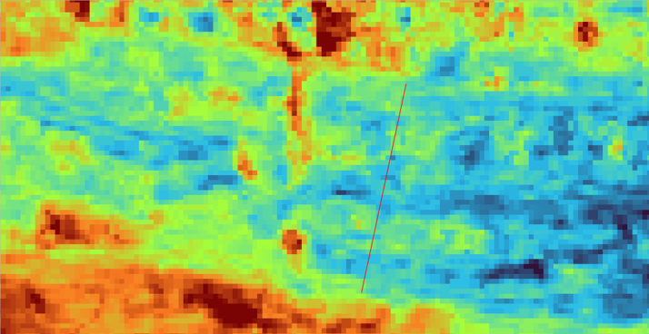
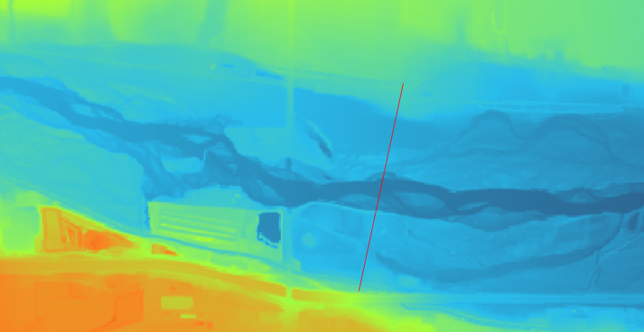
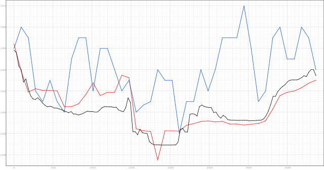
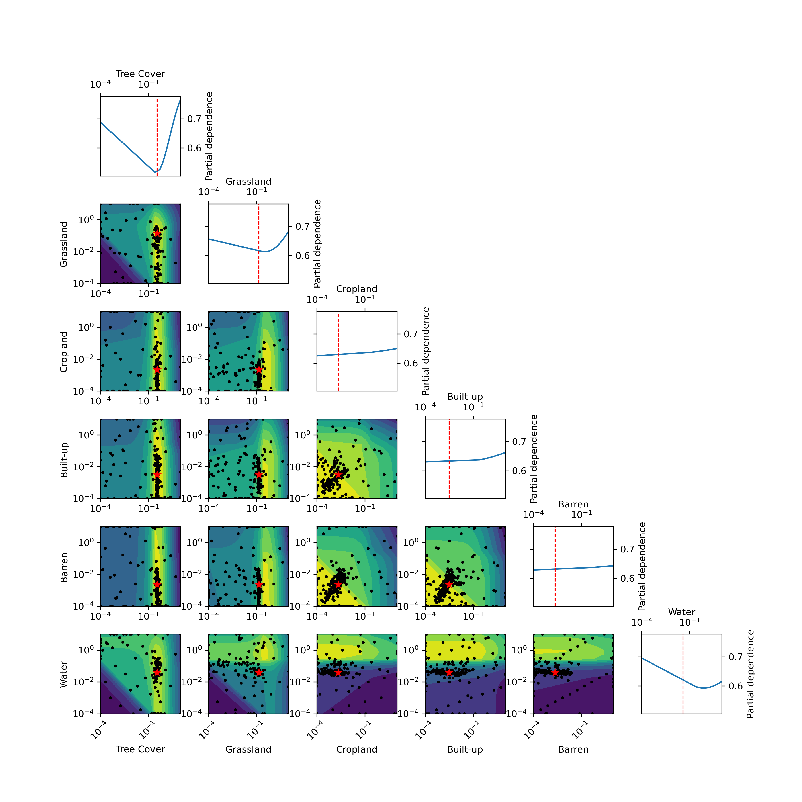
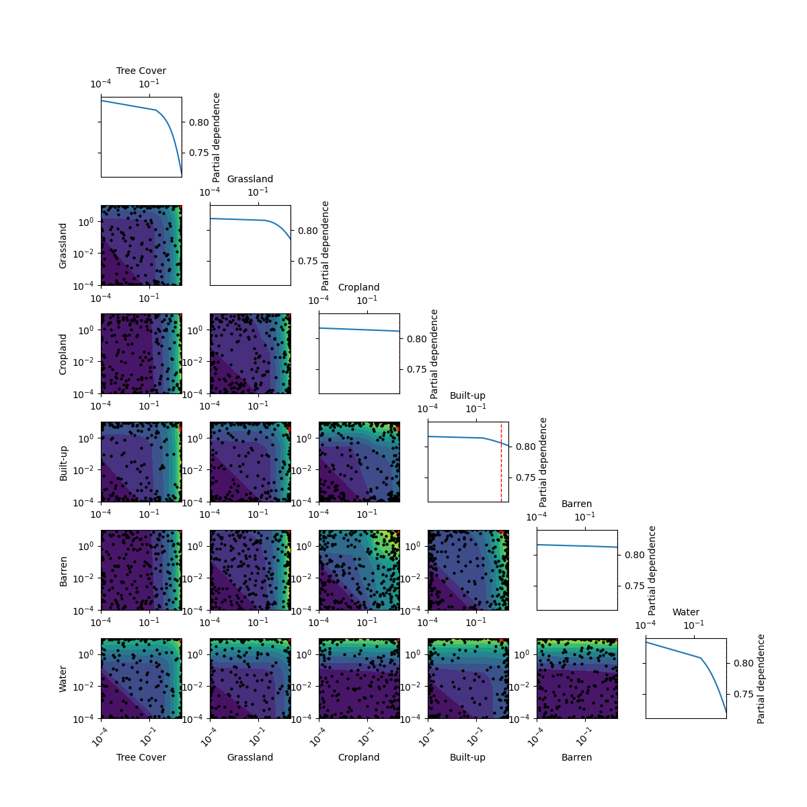

# Introduction
Manning's n is a coefficient used in hydrology to represent the roughness of a channel or surface, which affects the flow of water. Different Digital Elevation Models (DEMs) can yield different values of Manning's n, which in turn can affect the flood extents generated by hydraulic models. By comparing a flood inundation map generated using a DEM with a known Manning's n value to a reference flood inundation map, we can calculate the F-statistic, which is a measure of the similarity between the two maps. In this analysis, we will investigate how Manning's n values applied to different DEMs affect the F-statistic, whether these differences are statistically significant, and what implications this has for flood modeling.

# Data and Methods
The primary datasets we need are the DEMs, the Manning's n classification coverage, and the reference or "ground truth" flood inundation maps. Other datasets required for running the hydraulic model are held constant and will not be considered further (they have been tested in previous analyses). A summary of the datasets used can be found in @tab-datasets.

## DEMs
We use the following DEMs in our analysis: ASTER, AW3D30, COPDEM, FABDEM, GEDTM, NASADEM, SRTM, and USGS. Each DEM has different spatial resolutions and accuracies, which can affect the derived Manning's n values and the flood extents. The USGS DEM, from the USGS 3DEP program, is considered the most accurate and serves as our reference DEM. 

## Manning's n Classification
Manning's n values are assigned based on land cover classifications. We use land cover from ESA WorldCover 2021, which has a spatial resolution of 10 meters. The land cover classes are categorized into six types: Tree Cover, Grassland, Cropland, Built-up, Barren, and Water. There are additional land cover classes in the dataset, but they are occur infrequently in the typical flood plain and are not included in this analysis. 

## Reference Flood Inundation Maps
We use reference flood inundation maps generated frum the USGS Flood Inundation Mapping program. These maps are created using advanced hydraulic models, calibrated on observed flood events, and are considered the "ground truth" for our analysis. We have data for 30 sites across the US, with multiple flood stages per site, and for each stage we have a reference flood inundation map.

| Dataset                          | Description |
|----------------------------------|-------------|
| DEMs                             | ASTER, AW3D30, COPDEM, FABDEM, GEDTM, NASADEM, SRTM, USGS (reference) |
| Manning's n Classification       | Land cover from ESA WorldCover 2021 categorized into Tree Cover, Grassland, Cropland, Built-up, Barren, and Water |
| Reference Flood Inundation Maps  | Flood inundation maps from USGS Flood Inundation Mapping program for 30 sites across the US with multiple flood stages |

: tab-datasets Summary of datasets used in the analysis.

@fig-dems shows a visualization of different DEMs for a sample site, illustrating the differences in elevation data that can lead to different Manning's n values and flood extents.

::: {#fig-dems layout-ncol=2}


(a) ASTER DEM


(b) FABDEM


(c) USGS DEM


(d) Elevation comparison

**Visualization of different DEMs for a sample site.**

:::

## Data Analysis Methods
The goal is to find the optimal Manning's n value for each DEM that maximizes the F-statistic when comparing the generated flood inundation map to the reference map. The approach we use is as follows:
1. Define a range of allowable Manning's n values for each land cover type. We chose a range of 0.0001 to 10, which gives us a wide range of values to test.
2. Using Bayesian minimization, we begin with an initial guess of Manning's n values for each land cover type and iteratively adjust these values to maximize the F-statistic. The objective function will run the model using the Manning's n provided. We invert the F-statistic to minimize it instead of maximizing it (F-statistic ranges from 0-1, 1 being a perfect match). This process is repeated for each DEM, resulting in an optimal set of Manning's n values for each DEM.
3. We then compare the optimal Manning's n values across DEMs and analyze how they affect the F-statistic scores. We also perform statistical tests to determine if the differences in F-statistic scores across DEMs are significant, and whether certain land cover types have a greater influence on the scores than others.

# Data Analysis
Optimal Manning's n values were discovered for each DEM using Bayesian minimization. To ensure the optimizer converged, we ran for 400 iterations. To ensure the optimizer did not overfit, we split the data into a training set (70%) and a test set (30%), and computed the inverse F-statistic every 10 iterations during the optimization process. An example of this convergence and validation process for FABDEM is shown in @fig-convergence. From the figure, we can see that the optimizer coverge after about 250 iterations, and that the validation score closesly follows the training score, indicating that the optimizer is not overfitting. This trend is similar across all DEMs, with convergence occurring between 200-300 iterations and no evidence of overfitting.

{#fig-convergence width=800}

@fig-n-vs-fstat shows the optimal Manning's n values for each land cover type and DEM, along with the corresponding F-statistic scores. The vertical red dotted lines indicate the range of typical Manning's n values for each land cover type, based on literature values.

```{r}
library(tidyverse)
library(dplyr)
library(ggplot2)
library(scales)
names <- c("aster", "aw3d30", "copdem", "fabdem", "gedtm", "nasadem", "srtm", "usgs")
df <- data.frame()

for (name in names) {
    temp_df <- read.csv(paste0("C:\\Users\\lrr43\\Documents\\masters\\official_mannings_n_", name, ".csv"))
    temp_df$DEM <- name
    df <- rbind(df, temp_df)
}

df <- df |>
  mutate(Parameter = case_when(
    Parameter == "Manning_n_10" ~ "Tree Cover",
    Parameter == "Manning_n_30" ~ "Grassland",
    Parameter == "Manning_n_40" ~ "Cropland",
    Parameter == "Manning_n_50" ~ "Built-up",
    Parameter == "Manning_n_60" ~ "Barren",
    Parameter == "Manning_n_80" ~ "Water",
    TRUE ~ Parameter
  ))
```
```{r}
#| fig-width: 8
#| fig-height: 6
#| fig-cap: "Manning's n vs Average F−Statistic Score for Different DEMs"
#| label: fig-n-vs-fstat
ggplot(df, aes(x = Value, y = Score, color = DEM)) +
  geom_point(size = 4) +
  geom_vline(
    xintercept = c(0.01, 0.5),
    color = "red",
    linetype = "dotted",
    alpha = 0.7
  ) +
  scale_x_log10(labels=label_number(),
    breaks = c(0.0001, 0.001, 0.01, 0.1, 1, 10)) +
  facet_wrap(~Parameter) +
  labs(
    title = expression("Manning's " * italic(n) * " vs Average F-Statistic Score for Different DEMs"),
    x = expression("Manning's " * italic(n)),
    y = "F-Statistic Score"
  ) + theme_bw() +
  theme(axis.text.x = element_text(angle = 45, hjust = 1),)
```

Looking at this figure, we see some interesting trends. For tree cover, grassland, and water land cover classes, the optimal Manning's n values fall within the typical range of values found in literature. They also are quite consistnent across the majority of DEMs. This suggests that for these land cover types, the choice of DEM may not have a large influence on the optimal Manning's n values. For cropland, built-up, and barren land cover classes, there is much more variability in the optimal Manning's n values across DEMs, and many of the optimal values fall outside the typical range found in literature. This suggests that for these land cover types, the choice of DEM can have a significant influence. We must note that grassland, tree cover, and water are the most common land cover types in the flood plain. This may explain why the optimal Manning's n values for these land cover types are more consistent across DEMs, as there is more data to inform the optimization process. In contrast, cropland, built-up, and barren land cover types are less common in the flood plain, which may lead to more variability in the optimal Manning's n values across DEMs.

Another thing to note is the order of the DEMs. USGS scores the highest, followed by FABDEM and SRTM. We expect USGS to perform the best, as it is the most accurate DEM. FABDEM and SRTM are related products, suggesting that these DEMs may be better for flood modeling applications than the other DEMs tested.

@fig-objective-usgs shows the partial dependence plot for the USGS DEM. The partial dependance plot shows the relationship between each land cover type's Manning's n value and the F-statistic score, while holding the other land cover types constant. From the plot, we can see that for tree cover, grassland, and water, there is a clear parabloic relationship, with a clear minimia defined for each. The other land cover types show a linear relationship with a slope close to 0, suggesting that changes in Manning's n for these land cover types do not have a large influence on the F-statistic score. This is consistent with our earlier observation that the optimal Manning's n values for these land cover types are more consistent across DEMs, and that the choice of DEM may not have a large influence for these land cover types.

{#fig-objective-usgs width=800}

@fig-objective-gedtm shows the partial dependence plot for the GEDTM. This partial dependence plot for this DEM looks quite different compared to the others. This plot shows a relationship where F-statistic scores are maximized at the upper bound of Manning's n for nearly all land cover classes. This is an unusual relationship, and suggests that the optimization process may not have converged properly for this DEM, or that there may be some issue with the data or model for this DEM. This is further supported by the fact that GEDTM has the lowest F-statistic scores among all DEMs tested. For these reasons, the GEDTM does not seem suitable for flood modeling applications.

{#fig-objective-gedtm width=800}

I used a linear mixed effects model to test whether the differences in F-statistic scores across DEMs were statistically significant, while accounting for the fact that we have multiple stages per site (non-independence of observations) and that there may be different variances across DEMs. @fig-fstat shows the distribution of F-statistic scores by method. 

@tab-lme reveals some key insights. First, USGS performs better than any other DEM-derived flood map, and is statistically significant in all cases. The closest to the USGS is the FABDEM weighted DEM (~0.049), the single FABDEM (0.067) and the SRTM (0.077). These DEM-derived flood maps are the most suitable alternatives to the USGS DEM for flood modeling applications. The other DEMs, especiall GEDTM and ASTER, have much larger differences in F-statistic scores compared to the USGS, and may not be suitable for flood modeling applications.

The model diagnostics indicate that there may be some issues with the model fit, as there is some evidence of underdispersion and non-normality of residuals. However, given the complexity of the data and the fact that we have accounted for non-independence and heteroscedasticity, we will proceed with interpreting the model results, but with caution.


```{r}
#| label: fig-fstat
#| fig-width: 8
#| fig-height: 6
#| fig-cap: "Distribution of F-statistic Scores"
df <- read.csv("C:\\Users\\lrr43\\Documents\\masters\\official_investigate_map_combinations_03-23-2026.csv")
library(lme4)
library(tidyverse)

df <- df |>
  mutate(method = paste(dem_type, strategy, sep = "_")) |>
    mutate(method = reorder(method, f.statistic, FUN = median, decreasing=T)) |>
    mutate(method = as.factor(method)) |>
    mutate(site = as.factor(site)) |>
    mutate(stage = as.factor(stage)) |>
    mutate(method = relevel(method, ref = "usgs_single"))
model <- lmer(f.statistic ~ method + (1 | site/stage), data = df)
ggplot(df, aes(x = method, y = f.statistic, color = method)) +
  geom_boxplot() +
  theme(axis.text.x = element_text(angle = 45, hjust = 1)) +
  ggtitle("F-statistic by Method")
```


# Conclusions
In this analysis, we investigated how Manning's n values applied to different DEMs affect the F-statistic scores when comparing generated flood inundation maps to reference maps. We found that for certain land cover types (tree cover, grassland, water), the optimal Manning's n values were consistent across DEMs and fell within typical ranges found in literature. For other land cover types (cropland, built-up, barren), there was more variability in optimal Manning's n values across DEMs, suggesting that the choice of DEM can have a significant influence on these land cover types. In terms of overall F-statistic scores, the USGS DEM performed the best, followed by FABDEM and SRTM. The other DEMs, especially GEDTM and ASTER, had much lower F-statistic scores and may not be suitable for flood modeling applications. These findings highlight the importance of carefully selecting DEMs and calibrating Manning's n values for accurate flood modeling. 

Future work will include testing methods of globla flood inundation mapping using this information on optimal Manning's n values and DEM selection, and investigating how these findings may differ in different geographic regions or for different types of flood events.


